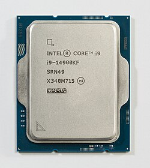
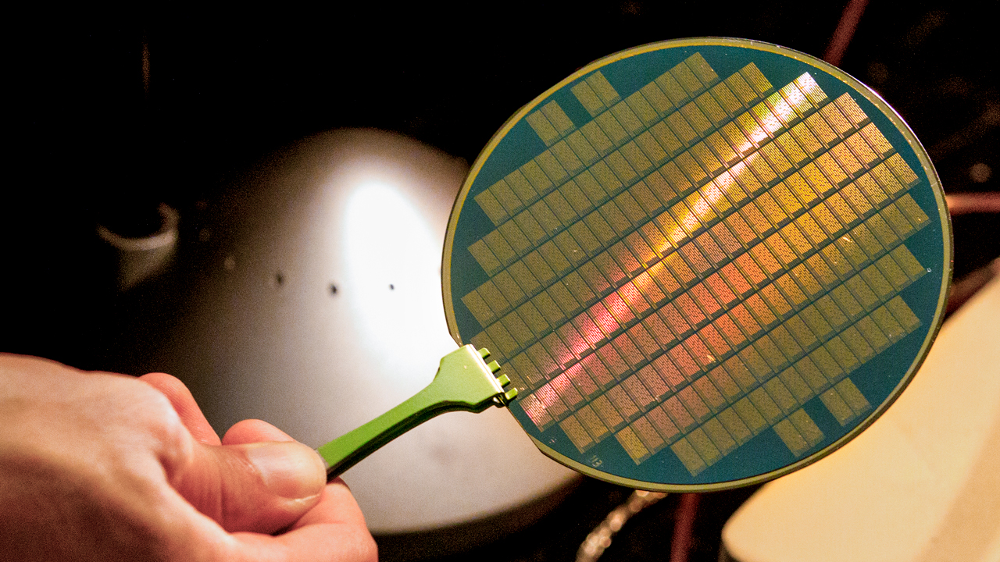
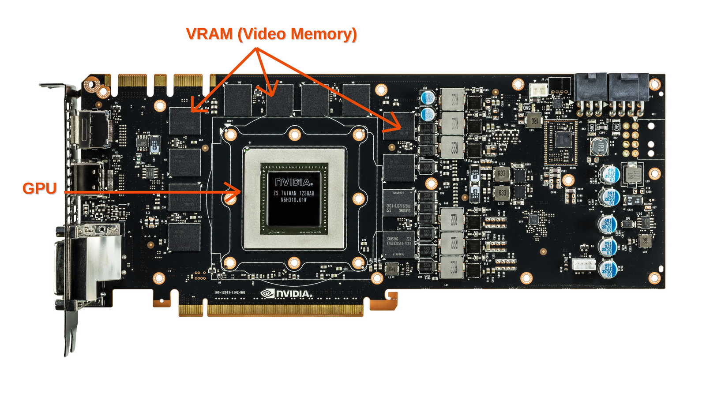

# Chapter 1: Understanding the <u>_Computer_</u>

### What is a computer?
At the lowest level, computer is just a bunch of transistors/electronic-components switching on and off some **Millions-Billions** of times per second.
#### At Human understandable Level, Computer is a device to perform complex operations which takes us humans, multiple days or even months! 

> when we say the word computer, we mean the **Desktop/Laptop** as a whole.

The word itself says **_compute-er_** : An object or thing which computes something.

A computer is made not only using one individual component but there are multiple devices within the computer.

## Components in the computer

### 1. CPU/Processor
This is the Brain of the computer.
The Processor is responsible for:
- All the Arithmetic and Logic Operations in the Computer.
- All the Input and Output (I/O) operations.
- Graphics processing (the one which is used to display things) etc.

#### Now, Processor can be divided into operation specific types like.

#### CPU (General Processor):
The general processor for computing Arithmetic and Logic operations. The CPU looks like this from the above: 

CPU.png

but from the inside, its just a silicon chip like this:

Silicon_Chip.png
<blockquote>Note that each of the gold plate on the wafer is a single processor in itself so there are many processors on this wafer.</blockquote>

For more information on How CPU works [This video](https://youtu.be/16zrEPOsIcI?si=oqbmiQaLzfC-9hR2) on youtube is highly recommended.

#### GPU (Graphics Processing Unit):
Responsible for the processing of everything we see on the monitors/screens. 

basically, it renders the processed data into images and looks like this physically:

GPU.png

Many more processors exist like NPU, TPU, DSP, IP, PPU, etc. which you can read more [here](https://en.wikipedia.org/wiki/Processor). But for now, these two are enough.

> #### Thats too much to process. Take a break. Come back in 10 minutes.

### 2. Memory